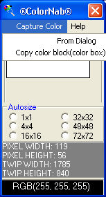



## ColorNabber

### Description

See a color in an application or on the web that you like and want to get its rgb or long value.

Or perhaps capture a block of that color to the clipboard to paste into your graphics app.

This is the program for you
 
### More Info
 

             |
---                |---
**Submitted On**   |2004-03-26 15:35:42
**By**             |[zoom2](https://github.com/Planet-Source-Code/PSCIndex/blob/master/ByAuthor/zoom2.md)
**Level**          |Intermediate
**User Rating**    |2.8 (17 globes from 6 users)
**Compatibility**  |VB 5\.0, VB 6\.0
**Category**       |[Complete Applications](https://github.com/Planet-Source-Code/PSCIndex/blob/master/ByCategory/complete-applications__1-27.md)
**World**          |[Visual Basic](https://github.com/Planet-Source-Code/PSCIndex/blob/master/ByWorld/visual-basic.md)
**Archive File**   |[ColorNabbe1724983262004\.zip](https://github.com/Planet-Source-Code/zoom2-colornabber__1-52677/archive/master.zip)

